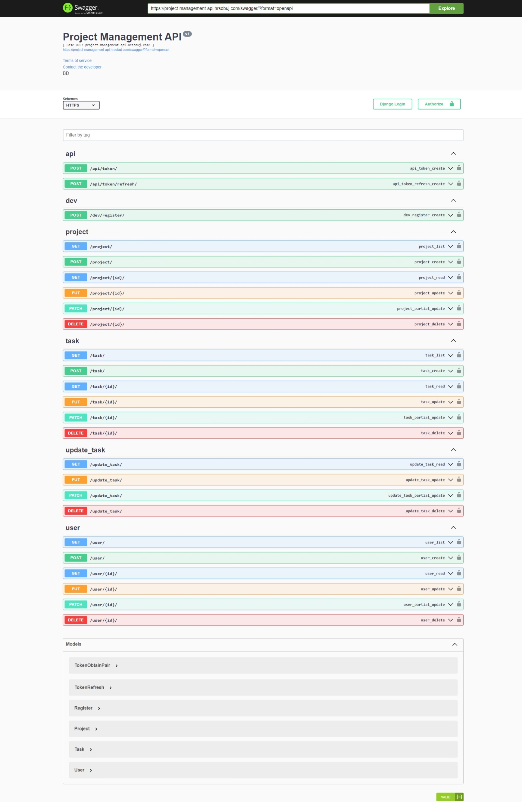

# Project Management Application Backend

This is the backend component of the Project Management Application. It is built using Django Rest Framework to provide an API for managing developer activity and project progress. The backend focuses on scalability, performance, and user-friendly project visualization.

## Table of Contents

- [Installation](#installation)
- [API Documentation](#api-documentation)
- [Screenshot](#screenshot)
- [License](#license)

## Installation

To install and run the backend of the Project Management Application, follow these steps:

1. Clone the repository to your local machine:

   ```bash
   git clone https://github.com/hr-sobuj/project-management-api.git
   ```

2. Navigate to the project directory:

   ```bash
   cd project-management-api
   ```

3. Create a virtual environment:

   ```bash
   python -m venv env
   ```

4. Activate the virtual environment:

   ```bash
   # For Windows
   env\Scripts\activate

   # For macOS/Linux
   source env/bin/activate
   ```

5. Install the required dependencies:

   ```bash
   pip install -r requirements.txt
   ```

6. Set up the database:
   - Configure the database settings in the `settings.py` file.
   - Run the database migrations:

     ```bash
     python manage.py migrate
     ```

7. Start the development server:

   ```bash
   python manage.py runserver
   ```

   The backend server will be accessible at `http://localhost:8000`.

## API Documentation

The API documentation for the Project Management Application Backend can be found at the following Swagger link:

[Swagger API Documentation](https://project-management-api.hrsobuj.com/swagger/)

The Swagger documentation provides detailed information about the available endpoints, request/response formats, and authentication requirements.

## Screenshot



This screenshot shows an example of the Swagger API documentation for the Project Management Application Backend.

## License

This project is licensed under the [MIT License](LICENSE). Feel free to use and modify the code as per your needs.
